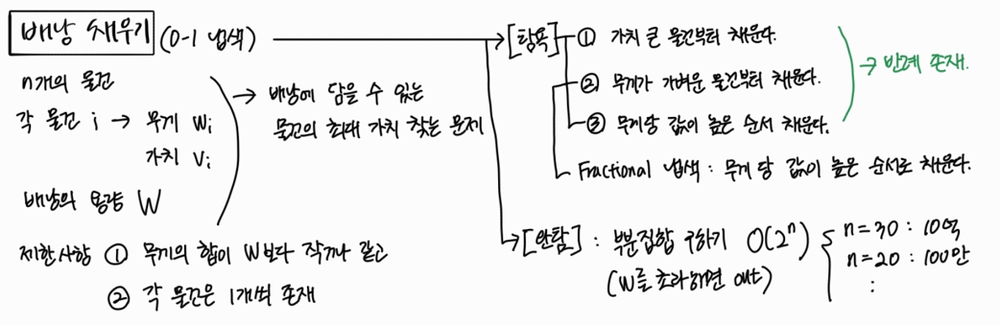
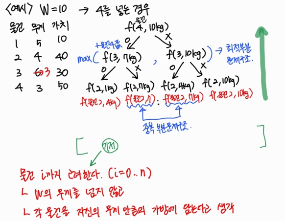
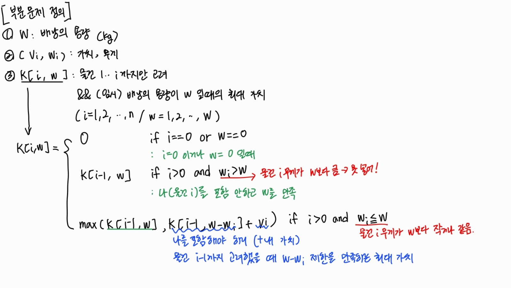

# 0-1 냅색

## 냅색 문제의 정형적 정의 

- N개의 물건들의 집합이 있을 때, 
- 각 물건들은 $w_i$의 무게와, $v_i$의 가치를 갖는다. 
- 이때 가방이 수용할 수 있는 무게는 `W`이다. 
- 물건들의 부분집합 중, 그 무게의 총합이 `W`를 안 넘으면서, 가치의 합이 최대가 되도록하는 부분집합을 구하게 한다. 

### 냅색 문제의 유형 
1. 0-1 냅색 
    - 배낭에 물건을 쪼개지 않고 통째로 담아야 할 때 
2. fractional 냅색 
    - 물건을 쪼개서 담을 수 있는 경우

## 0-1 냅색 문제의 사고 과정



**[탐욕]** 
- 완전탐색으로 부분집합을 모두 구하고, 부분집합의 총 무게가 W를 초과하면 버린다. ➡️ 시간복잡도: O($2^n$)
- n = 20이면 100만번, n = 30이면 10억번의 연산을 해야 하므로 n의 값이 중요해진다. 


**[0-1냅색]** 



  - 상태공간트리를 그려본 결과 최적부분문제구조와 중복부분문제구조를 모두 만족함을 알 수 있다. 
  - 따라서 `DP`로 접근해본다. 
  - 부분문제를 찾기 위해 필요한 문제의 조건을 살펴본다. 
    - 물건 
    - 물건의 무게 
    - 물건의 가치 
    - 배낭의 용량 
  - 물건, 물건의 무게는 부분문제를 정의하는데 반드시 필요하다 

DP로 풀 수 있다는 것을 알게 되었으니, 기저 조건을 찾아야 한다. 
- 물건 i까지 고려한다고 가정하자. 
- 그때 `W`의 무게를 넘지 않으면서 
- 각 물건을 자신의 무게만큼의 가방에 담는다고 생각해본다. 

## 0-1 냅색 문제의 부분문제 정의

**CASE 1: K[i-1, w]**

- 최적해는 물건 i를 포함하지 않는다고 가정할 때 


**CASE 2: K[i-1, w-$w_i$]** 

- 최적해는 물건 i를 포함한다고 가정할 때
- **전체 가치 = 물건 i의 가치 $v_i$ + 물건 1~(i-1)까지 고려하면서 배낭의 용량이 $w-w_i$인 경우의 최대 가치**


즉, CASE1 과 CASE 2가 미리 계산되어 있어야만 K[i,w]를 계산할 수 있다. 





## 0-1 냅색 문제의 sudo code 
```java
// 배낭의 용량 W 
// n개의 물건과, 각 물건 i의 무게 wi와 가치 vi 
// 단, i=1,2,3...n/ w=1,2,3..W 
// int[][] K = new int[n+1][W+1]

FOR i in 0->n: K[i,0] = 0
FOR w in 0->W: K[0,w] = 0

FOR i in 1..n
    FOR w in 1..W
        IF w_i > w  // 물건 i를 포함할 수 없는 경우 이전의 최대가치를 가져온다. 
            K[i,w] <- K[i-1, w]
        ELSE        // 물건 i를 포함할 수 있는 경우, w-w_i에 대한 이전의 최대가치를 가져온다. 
            K[i,w] <- max(v_i + K[i-1, w-w_i], K[i-1, w])
```

## 0-1 냅색 문제의 수행과정 
1. 배낭을 초기화한다.  
    - i=0이거나 w=0인 경우, 최대가치는 0이므로 이들을 초기화한다. 
2. 물건 i까지 차례대로 고려하며, w가 증가할 때 가질 수 있는 최대가치를 계산한다. 
3. 물건 n까지 모두 고려한 뒤, 얻을 수 있는 최대 가치는 `K[n+1][W+1]`이 된다. 

최종 결과: 


