# Knapsack 알고리즘 
📌과목평가 - 알고리즘 무조건 출제된다. (표랑 함께)

## 배낭 채우기 
냅색 문제의 정형적 정의 
부분집합들을 완탐하는데, 아무거나 하면 되는 게 아니라, 무게의 합 <= W 인 제한사항을 만족하는 
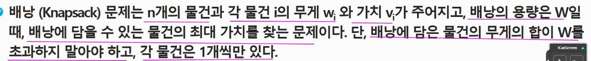
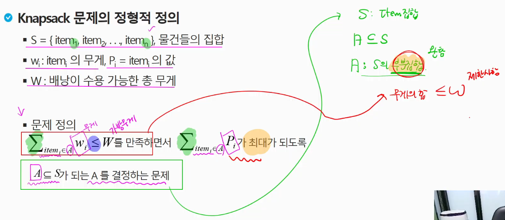
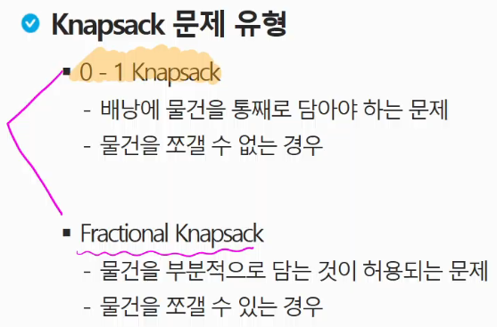
모든 부분집합을 구하는 건 O(2^n)인데, n=30만 되어도 10억, n=20은 100만 -> 얘는 가능 
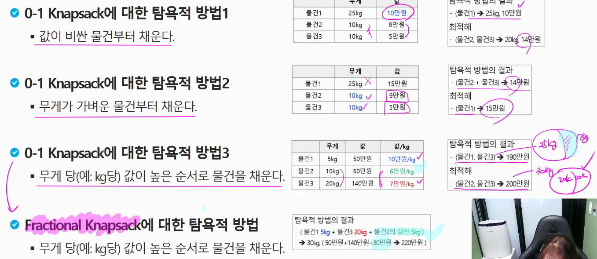
그리디를 만나면 0/1 냅색과 프랙셔널 냅색도 고려해봐야 한다. 

f(물건 4개, 10kg)
3kg의 50만원 가치를 담는다고 가정해보자. 이때 7kg에 대해서 최대가치를 가져올 수 있다면 그게 답 
-> f(물건 3개, 7kg)
3kg의 50만원 가치를 넣지 않는다고 가정해보자. 
-> f(물건 3개, 10kg)

이 2개의 선택 중 하나에 max(f(3,7), f(3, 10))

아래 상태공간트리를 통해 "최적부분문제구조"가 만족됨을 알 수 있다.
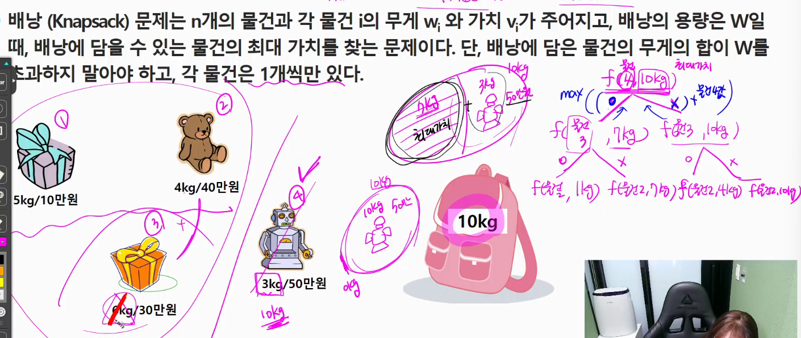
그렇다면 "중복부분문제구조"를 만족하는가? 
- 물건 3번의 무게를 3kg로 바꿨을 때 이 조건을 만족한다는 것을 알 수 있다. 
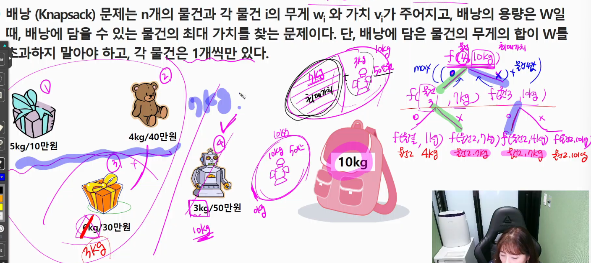

=> 재귀적인관계도 알아냈다. 
=> 그럼 이제 위-> 아래 말고, 아래-> 위로 올라가면서 계산하자. 

그렇다면 기저에 있는 애들이 어떻게 될까? 
- 하향식으로 할 게 아니라서 
- 기저에 있는 애들이 어떤게 필요할지 모른다. 

물건 i까지 W의 무게 만족 최적가치 
- 각 물건을 하나씩 담는다고 본다면, 
- 각 물건은 자신의 무게만큼의 가방에 담는다고 생각할 수 있다 
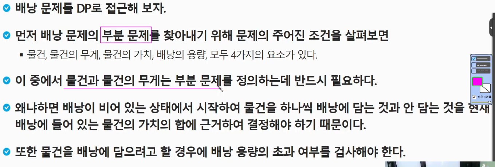
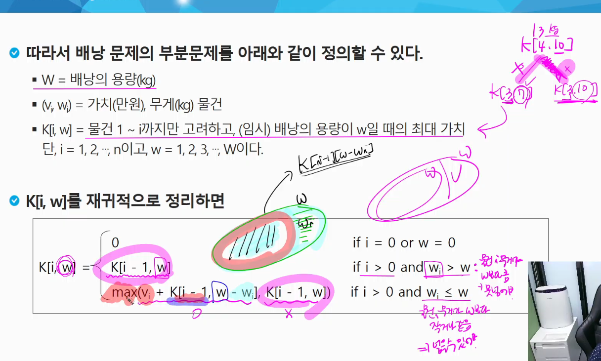
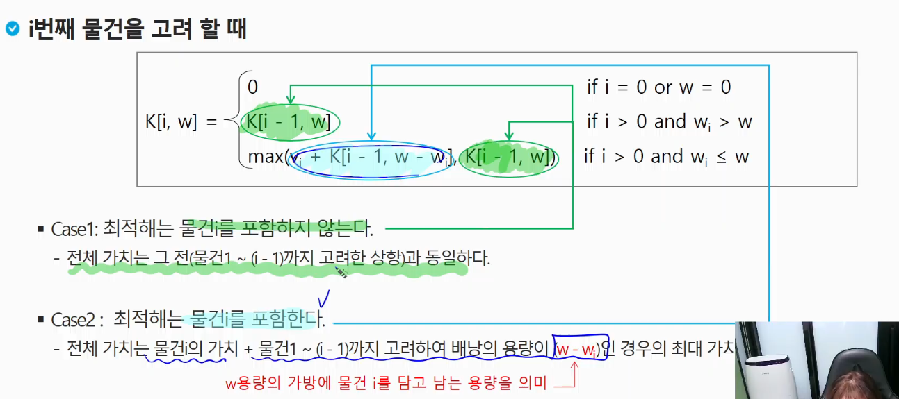

📌점화식 또는 표 채우기 문제 나옴

k[0,w] -> 물건 0부터 물건0까지 w채울 때의 최대 가치 => 0 
k[n,0] -> 물건 0부터 n까지 0무게를 채울 때 최대 가치 => 0; 가방에 넣을 수가 없기 때문에 
항상 이전 물건까지의 최적이 필요하기 때문에, 위의 초기화 과정이 필요하다

현재 내 무게가 w를 넘기면 담지 못하니까 k[i-1, w]가 그대로 넘어오고 
w를 넘기지 않으면,
- 1) 현재 나를 포함할 때의 가치 vi + i-1물건까지 고려하면서 w-내무게를 담았을때 즉, 이전의 최대가치
- 2) 나를 포함하지 않을 때의 최대가치 
- 1)과 2) 중에서 더 큰 가치를 가져온다. 
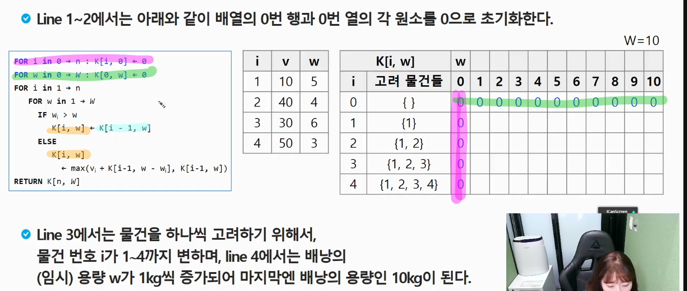

- 5kg의 가방에 온전히 물건1만 들어가 있는 상황 
- 그리고 물건 1만 고려했을 때 6~10kg을 수용할 수 있는 가방으로 용량이 늘어나더라도, 10이다 .
  - k[1,6] = max(k[0,6], k[0,1]+10) = max(0.10) = 10 
- 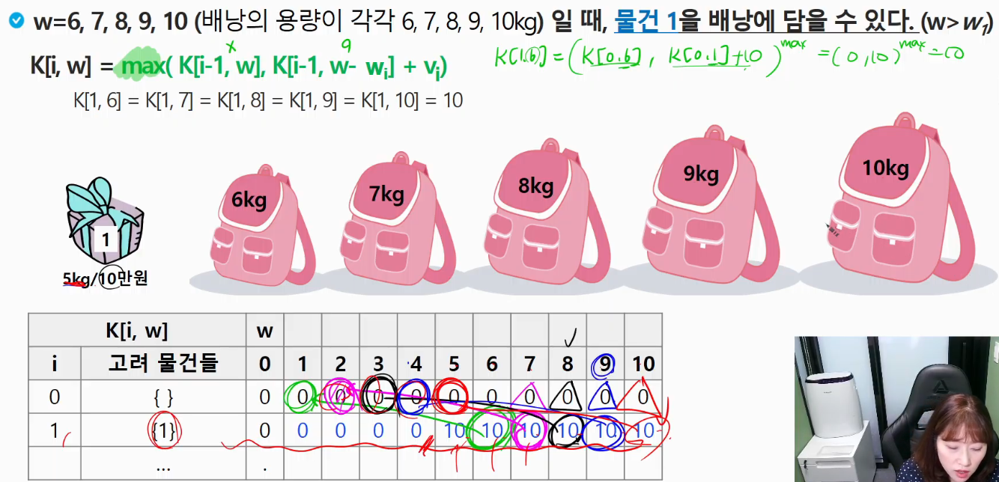

2까지 고려할때는? 
- w가 3까지는 모두 0이다. 왜냐하면 넣을 수 없기 때문임. 
- w가 4가 되면, 물건 2를 담을 수 있고 그때 최적가치가 40이 된다. 
- w가 5가 됐을 때 
  - 2를 넣지 않는 선택은 k[1,5] = 10의 가치를 갖고 ; 5kg을 수용할 수 있는 가방에 대해서 물건 1만 넣었을 떄의 가치와 물건 2만 넣었을 떄의 가치를 비교한다 
  - 2를 넣으면 가방의 무게가 1일 때의 최적가치와 내 가치 40을 더한 가치 40 
  - 따라서 40이 된다.
- 직전 물건까지의 최대가치를 고려해야 한다. 
- 즉 k[1,1], k[1,2], k[1,3] 
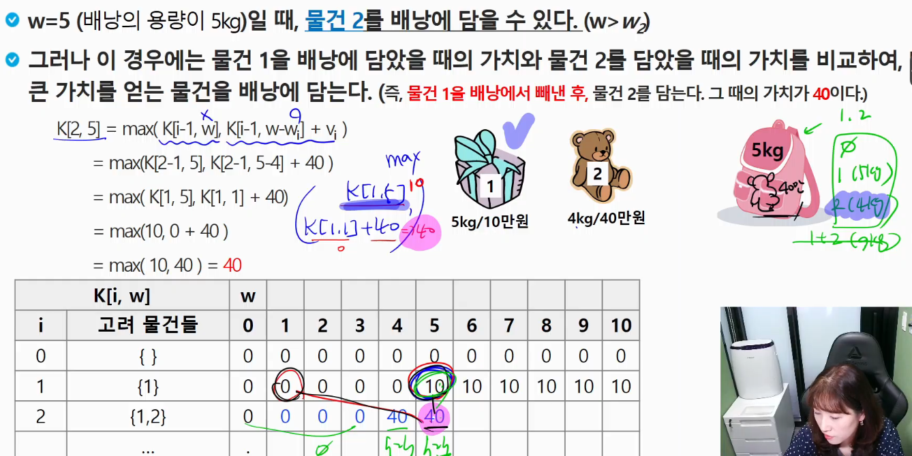
- w가 6,7,8일때까지 가방은 물건 1과 물건2를 동시에 넣을 수 없다. 따라서 최대가치인 40이 쭉 채워지게 된다 
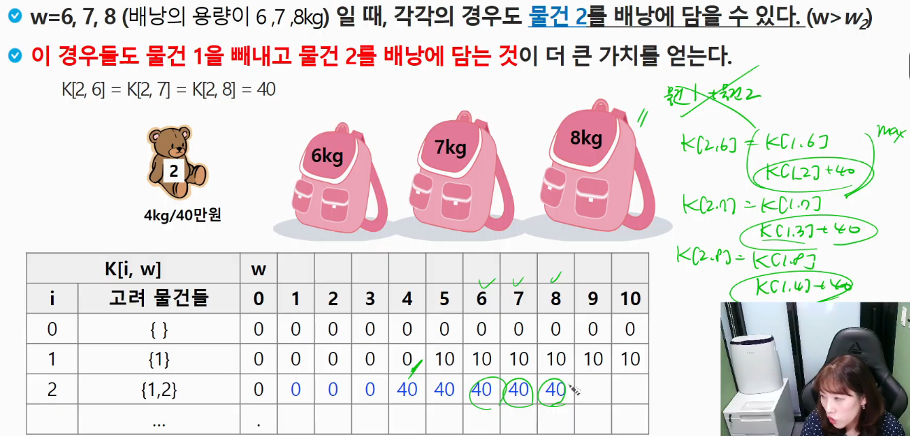
- w가 9가 된 순간부터, 가방은 9kg을 담을 수 있게 된다. 따라서 물건1과 물건2를 모두 수용할 수 있게 된다 
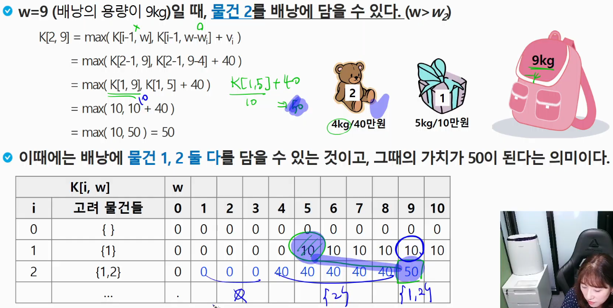

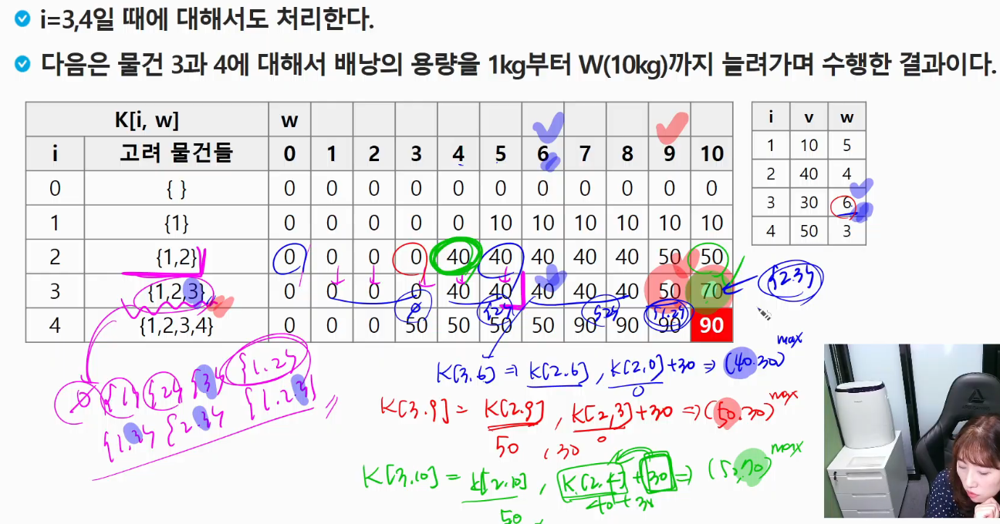
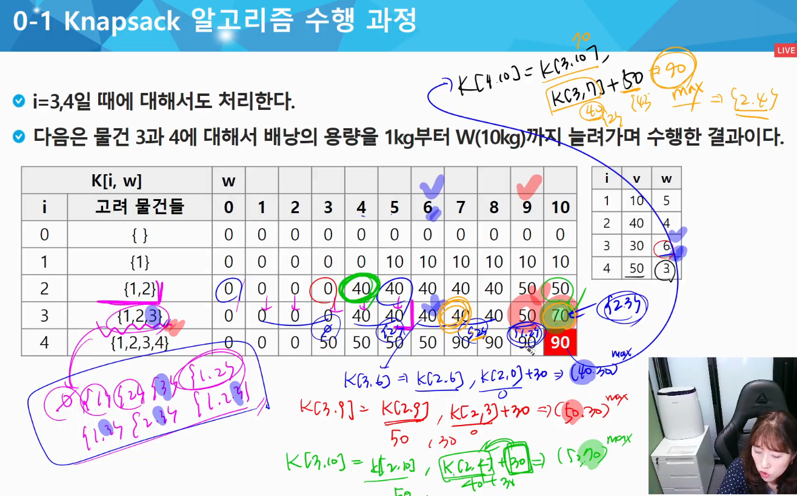
- 시간복잡도 O(N*W)

## 0-1냅색 추가고민1 
공간 복잡도 개선이 가능할까? 
- 점화식만 봐도 직전행만 쓰고 있다
- N*W 공간이 아닌, 2xW만 쓰거나 1xW를 2개를 쓰는 방법이 있을 수 있다. 
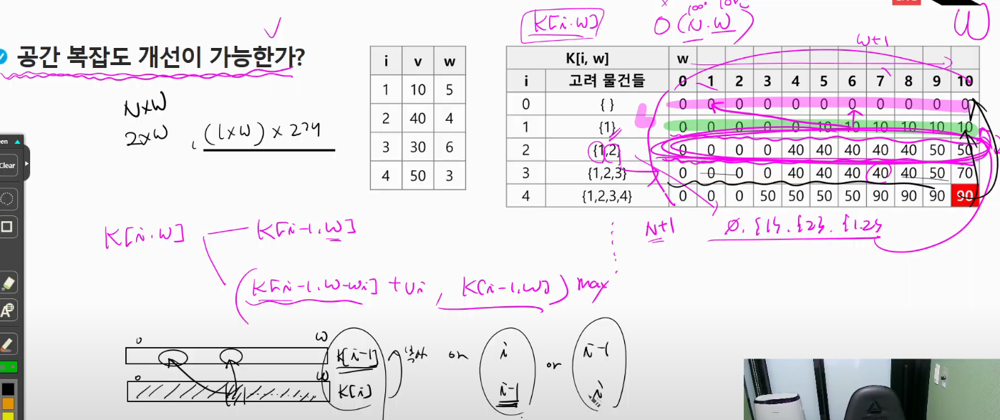

## 0-1냅색 추가고민2
- 물건을 여러 개 담는 것이 가능하다면? 
- 물건의 개수가 무제한이 되었다. 
- i번째 물건까지 고려하게 되었을 때, `K[i, w-w_i]+v_i`까지 고려해야 한다. 

하나의 테이블을 반복적으로 채우는 방향으로 갈 수 있다 

물건 i를 보고 있다고 할 때 
k[w] = k[w-w_i] + v_i(나를 넣는 경우) + k[w](나를 안 넣는 경우)
- 업데이트 전이므로 i-1의 상태를 기준으로 1차원 배열이 채워져 있고, 거기에 나를 추가할래 말래로 나누어진다. 
  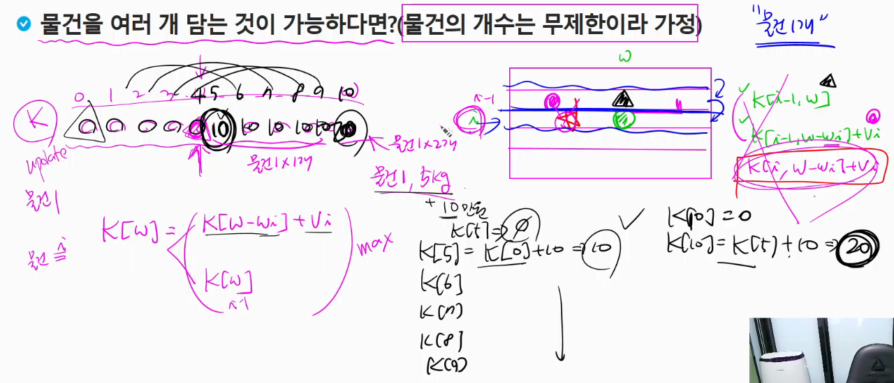

역순으로 계산하는 경우는 어떻게? 
- 