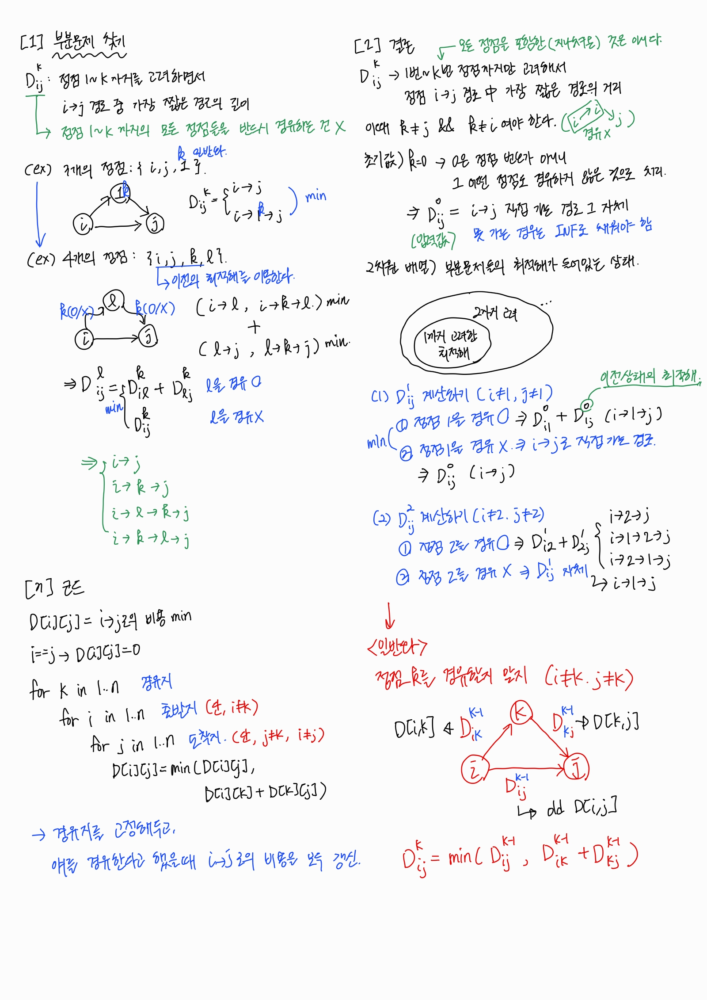

# 목차

- [목차](#목차)
- [플로이드 워샬](#플로이드-워샬)
  - [그래프 관련 알고리즘 차이점 정리](#그래프-관련-알고리즘-차이점-정리)
  - [완전 탐색으로 모든 경로를 따져본다면?](#완전-탐색으로-모든-경로를-따져본다면)
    - [상황](#상황)
    - [해결 방법](#해결-방법)
  - [DP 접근 방법](#dp-접근-방법)
    - [생각1. 각 정점을 시작 정점으로 해서 다익스트라 돌리기](#생각1-각-정점을-시작-정점으로-해서-다익스트라-돌리기)
  - [생각2. 플로이드 워샬 알고리즘으로 푼다면?](#생각2-플로이드-워샬-알고리즘으로-푼다면)
  - [플로이드 워샬 알고리즘 수행 과정](#플로이드-워샬-알고리즘-수행-과정)

# 플로이드 워샬

## 그래프 관련 알고리즘 차이점 정리

✅ **프림 / 크루스칼 (MST)**

- 목표: 그래프의 모든 정점을 연결하면서 간선 가중치 합이 최소가 되는 트리 **(최소 신장 트리)**
- 특징:
  - “경로 최단”이 아니라 **전체 연결 최소 비용.**
  - 출발/도착 정점이 따로 정해져 있지 않음.

✅ **다익스트라**

- 목표: **특정 출발 정점** → 다른 모든 정점까지의 최단 경로.
- 특징:
  - 출발 정점 고정.
  - 한 번 실행하면 "그 출발점 기준 최단거리 배열(**dist[]**)"을 얻음.
  - 양수 가중치 그래프에서만 동작.
- 시간복잡도: **O(E log V)** (우선순위 큐 사용 시).

✅ **플로이드–워샬**

- 목표: **모든 정점 쌍 (i, j)에 대해 최단 경로.**
- 특징:
  - 출발 정점이 고정되어 있지 않음 → **“모든 출발–도착” 쌍**을 동시에 계산.
- 동적 계획법(DP) 아이디어: `dist[i][j] = min(dist[i][j], dist[i][k] + dist[k][j])`
  - 중간 노드 k를 하나씩 늘려가며 갱신.
- 음수 간선 허용 (단, 음수 사이클은 불가).
- 시간복잡도: **O(N³)**. ➡️ 정점 개수가 적을 때(보통 N ≤ 400) 많이 사용.

## 완전 탐색으로 모든 경로를 따져본다면?

### 상황

- 그래프가 n개의 정점을 갖고 있고, 완전 그래프라고 가정하자.
- 한 정점 i에서 다른 정점 j까지의 최단 경로를 구한다고 해보자.
  - 출발 정점과 도착 정점을 임의로 고정할 때, $(n-2)!$ 경우의 수를 구하게 된다.

이런 경우가 모든 정점에 대해 생긴다고 하더라도,
지수 승($2^n$)보다, 팩토리얼($n!$)이 훨씬 시간복잡도가 크다.

### 해결 방법

➡️ 각 정점을 시작 정점으로 정하여, 다익스트라의 최단 경로 알고리즘을 수행한다.

- 인접 행렬 사용 시, $O(N^3)$ (정점의 수 N)
- 그러나, **음의 가중치가 발생한다면 다익스트라 알고리즘은 불가능하다.**
  - 이유: 다익스트라는 아직 방문하지 않은 정점 중 가장 짧은 거리의 정점을 선택하면, 그 거리는 절대 변하지 않는 최단거리 라고 확정짓는다. 모든 간선 가중치가 0 이상이기 때문에 가능하다. 음수 간선이 없기 때문에 이미 짧게 나온 경로보다 더 짧은 경로가 나중에 생길 수 없다.
  - 결론: 한 번의 탐욕적 선택이 전체 최적해를 보장하지 못해, "탐욕적 선택이 언제나 최적이다"라는 전제가 무너진다.

✅ **음의 가중치가 있을 때는, 플로이드 워샬을 사용해야 한다.**

## DP 접근 방법

> [!note] 
> 플로이드 워샬 알고리즘
>
> 모든 쌍의 최단 경로를 찾는 알고리즘

### 생각1. 각 정점을 시작 정점으로 해서 다익스트라 돌리기

- 인접행렬의 경우 ➡️ $n^2 * n = n^3$
- 인접리스트 + PQ ➡️ $V * (V+E)*logE$ (인접행렬 $n^3$보다 효율적)
  - 단, $E < V^2$ (희소그래프)라면 굉장히 효율적
  - 즉, 여기서 간선의 개수가 아주 중요하다.간선이 너무 많으면 비효율적이다.

➡️ 플로이드 알고리즘의 시간복잡도는 O($n^3$)이지만 너무 간단해서 최고임

## 생각2. 플로이드 워샬 알고리즘으로 푼다면?

배낭 채우기에서 처럼

- i의 최적해는 i+1에서 최적해를 구하는데 쓰인다.
- 즉, **i+1에는 i 상태까지의 최적해가 녹여져 있어서**, 그 안에 지나온 경로/정점개수등이 포함되어있다.

➡️ **i에서 j로 갈 때 k까지 살펴본 상태**를 $D_{ij}^k$라고 한다면

➡️ 이때 l을 거치는 것이 최적인지, 아닌지를 봐야 한다.

- `i->l->j` v.s. `i->j` ($D_{ij}^k$)
  - 이때 `i->l`도 최적이어야 하고, `l->j`도 최적이어야 한다.
  - ➡️`i,k,l` vs. `i,l` min => $D_{il}^k$
  - ➡️`l,k,j` vs. `l,j` min => $D_{lj}^k$
- 이 둘을 더한, 해가 기존의 최적해 $D_{ij}^k$와 비교해 더 최적해를 찾으면 되겠다.

## 플로이드 워샬 알고리즘 수행 과정

