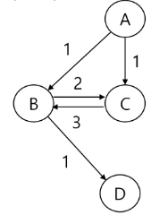
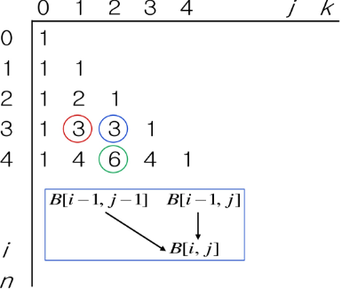

- [DP 동적 계획법](#dp-동적-계획법)
  - [동적 계획법의 적용 요건](#동적-계획법의-적용-요건)
  - [동적 계획법 풀이 과정](#동적-계획법-풀이-과정)
    - [최적의 원칙이 적용되지 않는 예](#최적의-원칙이-적용되지-않는-예)
    - [분할정복과 DP의 차이점](#분할정복과-dp의-차이점)
  - [예시1. 이항 계수 구하기 - 하향식 Top Down](#예시1-이항-계수-구하기---하향식-top-down)
  - [예시2. 동전 거스름 돈 구하기](#예시2-동전-거스름-돈-구하기)
  - [예시3. 미로 이동하기](#예시3-미로-이동하기)

# DP 동적 계획법

그리디 알고리즘과 같이 최적화 문제를 해결하는 알고리즘

> [!important]
> 하향식 설계 ➡️ 상태공간트리 그려보기 ➡️ 중복 호출 파악 ➡️ 상향식으로 뒤집어서 풀어내기

- 먼저 작은 부분 문제들의 해를 구하고,
- 이들을 이용하여 큰 크기의 부분 문제들을 해결하여,
- 최종적으로 원래 주어진 문제를 해결하는 알고리즘 설계 기법

## 동적 계획법의 적용 요건

1. 중복 부분문제 구조
   - 이전에 계산되었던 작은 문제의 해가, 다른 어딘가에서 필요하게 되는 것
2. 최적 부분문제 구조
   - 문제 A에 대한 해가 최적이면,
   - A의 작은 문제들의 해 역시 최적이어야 한다

## 동적 계획법 풀이 과정

1. 문제에 대한 이해, 정의
   - 최적해, 경우의 수
2. 부분 문제 식별
   - 상태 공간 트리를 적극적으로 활용
3. 동적 테이블을 정의한다.
   - 1차원, 2차원
   - EX) `D[i] = 값`
     1. `i`: 부분 문제의 상태
     2. `값`: 부분 문제를 해결한 값
4. 부분 문제들 간의 관계 파악 후, 점화식 도출
   - `D[i]`, `D[i-1]`, `D[i-2]` .. 어떤 관계인지
   - 관계 수립이 안되는 대상 = **기저 조건**
     - 더 작은 부분문제들을 이용해서, 자신을 정의할 수 없는 경우
5. 동적 테이블 초기화 후, 점화식을 이용해 문제 해 계산
6. 해 도출
   - 항상 마지막에 채워진 값이 해는 아니다.
7. 공간 복잡도의 최적화

### 최적의 원칙이 적용되지 않는 예

최장경로 문제



- 최장경로는 ACBD
- 그러나, A-C 사이의 최장경로는 ABC이다.
- 따라서, 전체 해의 작은 부분 문제의 해가 사용되지 않는다

### 분할정복과 DP의 차이점

- 분할정복은 연관 없는 부분 문제들로 나뉜다.
- DP는 부분문제들이 연관이 있다.

## 예시1. 이항 계수 구하기 - 하향식 Top Down

이항계수를 `nCk`를 구하는 재귀함수

- 계산량이 많은 `n!` 또는 `k!`를 계산하지 않고 `n-1Ck-1 + n-1Ck` 를 사용한다.
  - n번째 수를 선택한 경우: `n-1Ck-1`
  - n번째 수를 선택하지 않은 경우 `n-1Ck`
  - 

```java
// O(nk)

B[][] // 동적테이블
FOR i in 0..n
    FOR j in 0..min(i, k)
        IF j==0 OR j==i
            B[i][j] = 0
        ELSE
            B[i][j] = B[i-1][jj-1] + B[i-1][j]

RETURN B[n][k]
```

## 예시2. 동전 거스름 돈 구하기

문제

- N원을 1원, 6원, 8원을 사용해서 거슬러줄 때, 사용할 최소 동전의 개수

상태공간트리

DP접근: 상향식

- 1원 최적해 -> 2원 최적해 -> .. -> N원에 대한 최적해
- `C[n] = n원을 거슬러 줄 때의 최소 동전 수`
- 점화식: `C[n] = MIN(n>=1이면 C[n-1]+1, n>=4이면 C[n-4]+, n>=6이면 C[n-6]+1)`

## 예시3. 미로 이동하기

문제

- NxM 배열에서, 오른쪽/ 아래/ 대각선 오른쪽 아래로만 이동 가능하다.
- 이때, 각 칸에는 자연수가 적혀있다.
- (0,0)에서 (N,M)으로 갈 때 수들의 합이 최대가 되는 경우, 그 합은?

점화식

- `D[N+1][L+1]`
  - 패딩을 주자. `i==0`이거나 `j==0`인 경우에는 나에게 오는 3방향이 모두 기존 배열 안에 없기 떄문이다.
- `D[N][M] = (1,1)에서 (N,M)까지 도달했을 경우 최대로 획득가능한 선물 개수`
- `D[N][M] = max(D[N-1][M], D[N-1][M], D[N][M-1])`
