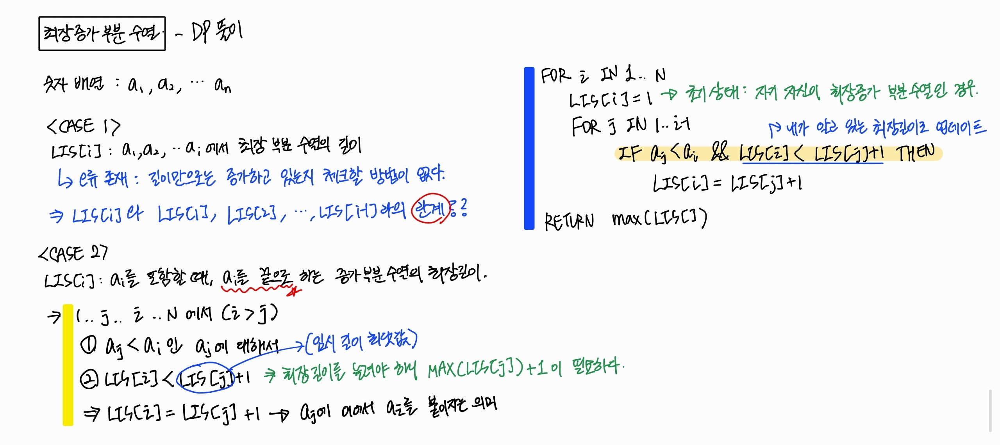
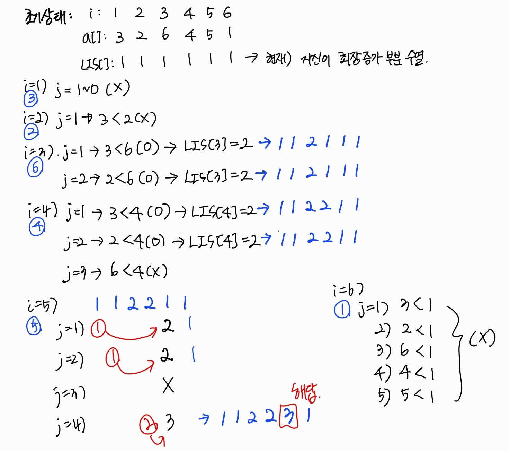
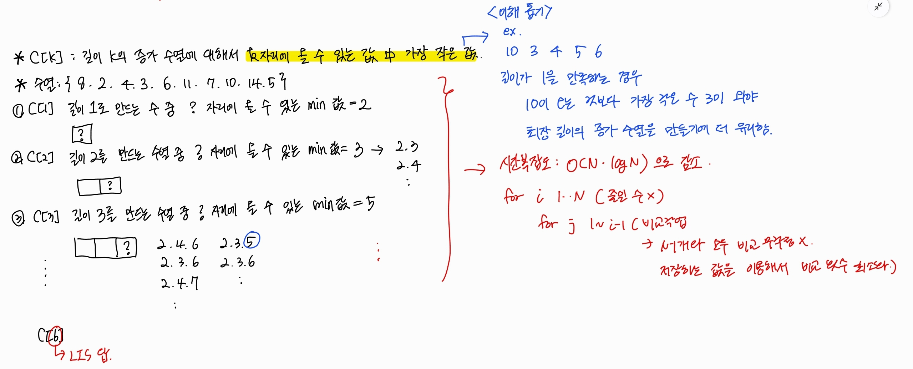
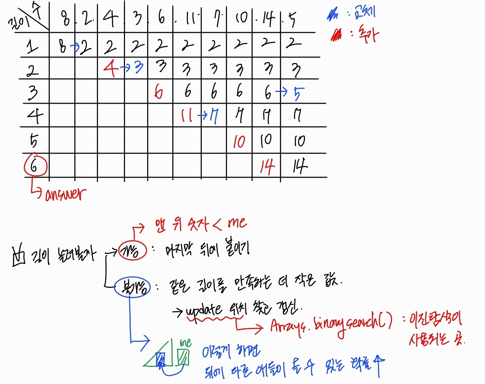

# 목차 
- [목차](#목차)
- [최장증가부분수열 LIS](#최장증가부분수열-lis)
  - [최장증가부분수열 - DP](#최장증가부분수열---dp)
  - [최장증가부분수열 - 이진 검색 활용](#최장증가부분수열---이진-검색-활용)
  - [코드로 구현](#코드로-구현)


# 최장증가부분수열 LIS 

> [!note]
> `3, 2, 6, 4, 5, 1` 
> 이와 같은 수열이 있다고 할 때
> 
> - **배열 순서를 유지**하면서 
> - 크기가 **점진적으로 커지는** 
> - 가장 긴 부분의 수열의 길이는? 
>
> 위의 문제의 해는 3. 
> - 최장 증가 수열의 해 중 하나는 `2,4,5`이다. 

✅ 정의 
- Longest Increasing Subsequence (LIS)
- 어떤 수열이 왼쪽에서 오른쪽으로 나열되어 있으면 
- 그 배열 순서를 유지하면서 크기가 점진적으로 커지는 가장 긴 부분 수열을 추출한다. 

✅ 완전 탐색으로 접근한다면? ➡️ 시간복잡도 O($2^N$)
- 모든 부분 집합을 구하고, 
- 그 부분 집합이 증가 수열인지 판별하면 되는데, 
- 부분수열의 길이가 긴 것부터 조사하면 된다.  
- 그러나, $N = 10^3$이면 100만, $N = 10^4$이면 10억번의 연산을 해야 한다. 


## 최장증가부분수열 - DP 

✅ 시간복잡도 O($N^2$)

✅ 답 != `LIS[N]`
- 이유: 누구를 마지막으로 하는 게 최장 길이인지 모르기 때문에 항상 마지막에 있는 LIS값이 정답이 아니다. 
- 따라서, 모든 정점 연산을 마친 뒤에, LIS[] 값 중, MAX 값을 찾아야 한다. 





## 최장증가부분수열 - 이진 검색 활용 

✅시간복잡도 O($N*log_n$)

> [!tip]
>
> 📌 결과는 LIS를 구성하는 해가 아니다. 
>
> 📌 각 길이마다, 내가 그 끝에 들어간다 할 때, 바로 선행 값이 무엇인지 기억해야 한다. 
>
> 📌 이진 탐색을 이용해서 내가 어디를 갈 수 있는지 찾는다 `Arrays.binarysearch()` 
> - 항상 검색은 실패한다. (중복된 수가 있는 수열이 아니라는 가정 하에)
>   - 만약 중복된 수가 존재해, 검색이 성공한다고 하더라도, LIS의 길이에는 변화가 없기 때문에 무시하면 된다. 
> - 이때 그 수가 들어가야 하는 위치는 이 함수의 반환값 pos를 이용해 `-(pos + 1)` 위치에 넣으면 된다. 






## 코드로 구현 
```java
Scanner sc = new Scanner(System.in);
int N = sc.nextInt(); 
int[] arr = new int[N]; 
int[] tail = new int[N]; 
```