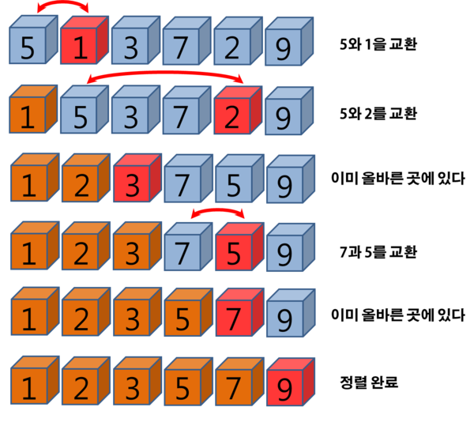

# 선택 정렬

✅ 정의 

- 가장 작은 값의 원소부터 차례대로 선택해서 위치를 교환한다. 
  

✅ 정렬 과정 

1. 주어진 리스트 중에서 MIN을 찾는다. 
2. 그 값을 리스트의 맨 앞에 위치한 값과 교환한다. 
3. 맨 앞에 위치를 제외한, 나머지 리스트를 대상으로 위의 과정을 반복한다. 

✅ 시간복잡도 $O(N^2)$

## 선택 정렬 수행 과정 

